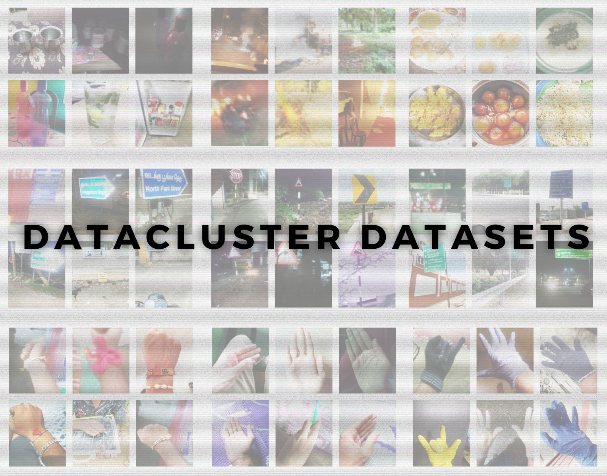

# Datacluster Dataset List
List of datasets that Datacluster Labs have created using Crowdsourcing Platform Dailydata.  

|        Dataset         | #images | #contributors | #classes |                                                                   Highlights                                                                  |                                                            Use-cases                                                           | Annotations                            |
|:----------------------:|---------|---------------|----------|:---------------------------------------------------------------------------------------------------------------------------------------------:|:------------------------------------------------------------------------------------------------------------------------------:|----------------------------------------|
|  Fire & Smoke Dataset  |  5000+  |     1000+     |     2    | * Domestic fire & smoke images * Focused on early or start of the fire * Indoor & Outdoor real-world lighting                                 | * Early fire or smoke detection * Fire-based anomaly detection * Fire classification                                           | Bounding Box (COCO, YOLO)              |
|   Trash Image Dataset  |  9000+  |     2000+     |    10    | * Common daily life trash objects * Material tag for trash objects  * Indoor & outdoor real-world lighting                                    | * Trash classification and detection * Eco-friendly recommendations * Common objects in differet shapes                        | Bounding Box (COCO, YOLO)              |
|   Wrist Image Dataset  |  6000+  |     3000+     |     3    | * Multiple orientation of hand & wrist * Wrist contains various objects like wrist-watches, bands etc. * Indoor & outdoor real-world lighting | * Useful for Augmented Reality applications * Detecting Wrist, nails, fingers and fist etc. * Gesture detection based on hands |        Bounding Box (COCO, YOLO)       |
|  Bottles & Cup Dataset | 4000+   |     3000+     |     4    | * Wide variety of bottles & cups * High level material classification * Real-world indoor environment                                         | * Useful for common object detections * Material classification of objects                                                     | Material classification,  bounding box |
|   Indian Food Dataset  |  4000+  |     2000+     |     -    | * Wide variety of Indian dishes * Daily meals, sweet dishes etc. * Real-world indoor environment                                              | * Food classification * Calorie estimation  * Food segmentation                                                                |      Classification, bounding box      |
|  Palm & Gloves Dataset |  9000+  |     4000+     |     3    | * Wide variety of hand-gloves  * Images from different age & gender groups * Wide variety of lighting conditions                              | * Gloves detection  * Gesture detection                                                                                        |        Bounding Box (COCO, YOLO)       |
| Traffic Sign Dataset   |  6000+  |     2000+     |     -    | * Captured across 20+ Indian cities * Wide variety of traffic signs  * Real-world and various weather conditions                              | * Traffic sign detection  * Autonomous driving                                                                                 |        Bounding Box (COCO, YOLO)       |
| Road Signboard Dataset |  6000+  |     2000+     |     -    | * Covers different Indian language signboards * Captured across 20+ Indian cities * Real-world and various weather conditions                 | * Signboard detection  * Autonomous driving * Multi-language signboard reading                                                 |        Bounding Box (COCO, YOLO)       |

# Datacluster Labs Datasets

Datacluster Labs focuses on Crowd Data Collection through our managed crowd-sourcing platform - [Dailydata](https://play.google.com/store/apps/details?id=com.daily.data). 

We provide integrated services for your AI needs:  
* Data Collection  
* Data Curation  
* Data Annotation 

We deal with all types of multimedia data collection and annotation like images, videos, audio, text and surveys.

**To download full datasets or to submit a request for your dataset needs, please contact **contact@datacluster.in****  

To download the full datasets, please contact [contact@datacluster.in](contact@datacluster.in).  
Visit [www.datacluster.in](www.datacluster.in) to know more.
  
    
# Dataset Description  

**Note:**  
**All the images are manually verified and are contributed by the large contributor base on our platform.** 

- [Domestic Fire and Smoke Dataset](#Fire-and-Smoke-Image-Dataset)  
- [Wrist Image Dataset](#Wrist-Image-Dataset)  
- [Bottles and Cups Image Dataset](#Bottles-and-Cups-Image-Dataset)    
- [Domestic Trash Dataset](#Domestic-Trash-Dataset)  
- [Indian Food Image Dataset](#Indian-Food-Image-Dataset)  
- [Indian Traffic Sign Image Dataset](#Indian-Traffic-Sign-Image-Dataset)  
- [Indian Signboard Image Dataset](#Indian-Signboard-Image-Dataset)  
- [Palm & gloves Image Dataset](#Palm-&-gloves-Image-Dataset)  

***

## Domestic Fire and Smoke Image Dataset

This dataset consists of domestic Fire and Smoke images. 

**Introduction**    
Dataset consists of Early fire and smoke images captured using mobile phones in real-world scenario. Images were captured under a wide variety of lighting conditions (indoor and outdoor scenes), weather, etc. This dataset is well suited for Early Fire and Smoke detection. Dataset could be used for Fire and Smoke recognition, detection, early fire and smoke, anomaly detection etc. Dataset also consists of typical domestic scenes like garbage burning, paper-plastic burning, field crop burning, domestic cooking etc.      

**Dataset Highlights:**
* Captured by 1000+ unique users  
* Domestic fire and smoke images    
* Early Fire and smoke Images  
* HD Resolution  
* Highly diverse  
* Various lighting conditions  
* Various weather condition  
* Indoor and Outdoor scene  
* Variety of view points  

**Dataset Format**  
* 2-class (fire and smoke) Bounding box annotation   
* COCO, PASCAL VOC and YOLO formats  
* Approx. 5000 unique images  

**Sample Images (Outdoor)**  
      

**Sample Images (Indoor)**  
      

## Domestic Trash Dataset  

This dataset consists of images domestic trash/litter object like paper/plastic cups, batteries, razor, plastic bags etc.  

**Introduction**    
Dataset consists of images of domestic common trash objects in context. Images were captured under wide variety of lighting conditions, weather, indoor and outdoor. This dataset can be used for make trash/litter detection models, eco-friendly alternative suggestions, carbon footprint generation etc.      

**Dataset Features**  
* Various trash object classes  
* Has material labels  
* Captured by 5000+ unique users  
* Rich in diversity 
* Mobile phone view point    
* HD Resolution  
* Various lighting conditions  
* Indoor and Outdoor scene   

**Dataset Format**  
* Classification and detection annotations available   
* COCO, PASCAL VOC and YOLO formats  
* Approx. 9000 unique images  

**Sample Images**  
         

## Wrist Image Dataset   

This dataset consists of images of wrist (with different kind of bands on it).

**Introduction**    
Dataset consists of images of wrist captured using mobile phones in real-world scenario. Images were captured under wide variety of lighting conditions, weather, indoor and outdoor. This dataset can be used for Augmented Reality, Mixed Reality, Rakhi Detection, Wrist-watch Detection, Hand-band Detection, etc.    

**Dataset Features**  
* Captured by 3000+ unique users  
* Rich in diversity 
* Mobile phone view point  
* Various items on the wrist  
* Consists male and female wrists
* HD Resolution  
* Various lighting conditions  
* Indoor and Outdoor scene   

**Dataset Format**  
* Classification and detection annotations available   
* COCO, PASCAL VOC and YOLO formats  
* Approx. 6000 unique images  

**Sample Images**  
         

## Bottles and Cups Image Dataset   

This dataset consists of images of bottles and cups.

**Introduction**    
Dataset consists of images of bottle and cups captured using mobile phones in real-world scenario. Images were captured under wide variety of indoor lighting conditions. This dataset can used for detection of a wide variety of bottles and cups made up of variety of materials from a lot of different of view-points, locations, orientation, etc.    

**Dataset Features**  
* Captured by 3000+ unique users  
* Captured using mobile phones    
* Variety of different material of bottles and cups   
* HD Resolution    
* Highly diverse  
* Various lighting conditions  
* Indoor scenes     

**Dataset Format**  
* Classification and detection annotations available   
* COCO, PASCAL VOC and YOLO formats  
* Approx. 4000 unique images  

**Sample Images**  
          

## Indian Food Image Dataset   

This dataset consists of images of Indian food.

**Introduction**    
Dataset consists of images of Indian food captured using mobile phones in a real-world scenario. Images were captured under wide variety of indoor lighting conditions. It consists of wide variety of dish images taken accross India.  This dataset can be used for recoginition, fine-grained detection of wide variety of cooked food. This can also be used to health related analytics like calorie counting, understanding dish ingredients etc. Each image can have multiple labels based on the use case.    

**Dataset Features**  
* Captured by 5000+ unique users
* Covers wide variety of Indian dishes
* Captured using mobile phones    
* Highly diverse 
* Various lighting conditions  
* Indoor scenes     

**Dataset Format**  
* Classification and detection annotations available  
* Multiple category annotations possible 
* COCO, PASCAL VOC and YOLO formats  
* Approx. 3500 unique images  

**Sample Images**  
          

## Indian Traffic Sign Image Dataset   

This dataset consists of images of Indian Traffic signs.

**Introduction**    
The dataset consists of Indian traffic signs images for classification and detection. The images have been taken in varied weather conditions in daylight, evening and nights. The dataset has a wide variety of variations of illumination, distances, view points etc. This dataset represents very challenging set of unstructured images of Indian traffic signs. This dataset can be used for recoginition and detection for driver assistance systems, autonomus driving etc.    

**Dataset Features**  
* Captured by 2000+ unique users
* Covers wide variety of Indian traffic signs
* Captured with 20+ cities accross India
* Captured using mobile phones    
* Highly diverse 
* Various lighting conditions like day, night,   
* Outdoor scene with variety of view points

**Dataset Format**  
* Classification and detection annotations available  
* Multiple category annotations possible 
* COCO, PASCAL VOC and YOLO formats  
* Approx. 6000 unique images  

**Sample Images**  
          

## Indian Signboard Image Dataset   

This dataset consists of images of Indian Signboards captured accross different cities in India.  

**Introduction:**    
The dataset consists of Indian traffic signs images for classification and detection. The images have been taken in varied weather conditions in daylight, evening and nights. The dataset has a wide variety of variations of illumination, distances, view points etc. This dataset represents a very challenging set of unstructured images of Indian traffic signboards.
    

**Dataset Features:**  
* Captured by 2000+ unique users
* Covers wide variety of Indian traffic signs
* Captured with 20+ cities accross India
* Captured using mobile phones    
* Highly diverse 
* Various lighting conditions like day, night,   
* Outdoor scene with variety of view points

**Dataset Format**  
* Classification and detection annotations available  
* Multiple category annotations possible 
* COCO, PASCAL VOC and YOLO formats  
* Approx. 6000 unique images  

**Sample Images**  
          

## Palm & gloves Image Dataset   

This dataset consists of Palm (Human hand) images in a real-world scenario.  

**Introduction**    
The dataset consists of images of Human palm captured using mobile phone. The images have been taken in real-world scenario like holding objects or performing simple gestures. The dataset has wide variety of variations like illumination, distances etc. It consits of images of 3 main gestures: Frontal-open palm, Back open palm and fist with wrist. It also have a lot of images with people wearing gloves.   
   

**Dataset Features**  
* Captured by 4000+ unique users
* Covers wide variety of palm images in indoor and outdoor scenes
* Images of palm with gloves
* Captured by male and female
* Distributed age groups like teenage, adults and old  
* Captured using mobile phones    
* Highly diverse 
* Various lighting conditions like day, night, indoor and outdoor    
* Outdoor scene with variety of view points

**Dataset Format**  
* Classification and detection annotations available  
* Multiple category annotations possible 
* COCO, PASCAL VOC and YOLO formats  
* Approx. 9000 unique images  

**Sample Images**  
                   
